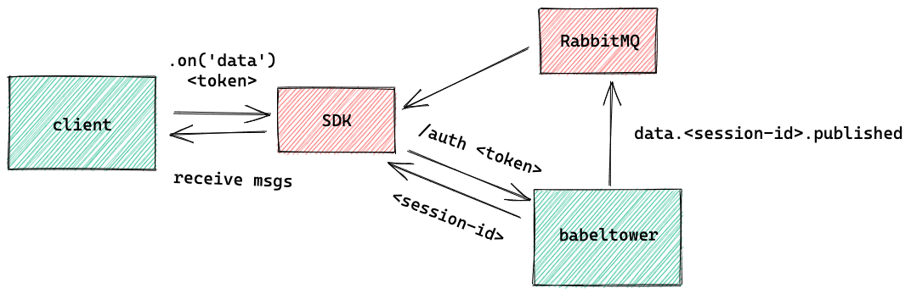
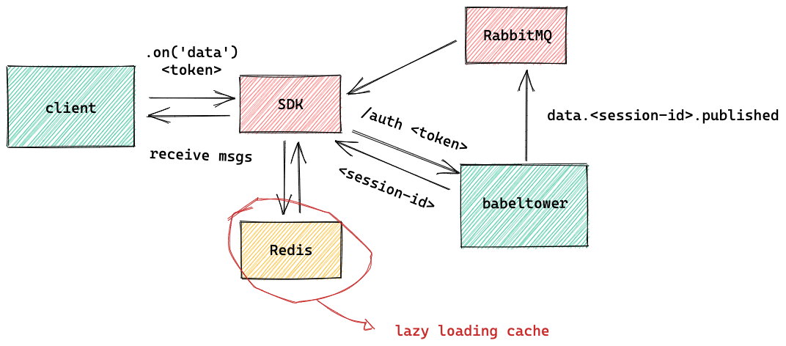

# Proposal

#### Investigations

- ~~Usage of [RabbitMQ HTTP backends](https://github.com/rabbitmq/rabbitmq-server/tree/master/deps/rabbitmq_auth_backend_http) for authn/authz~~
- ~~Feasibility of adding a new authentication operation to the API~~
- ~~Coupling with Messaging technology (could be added via adapter?)~~
- Different vhosts for internal/external communication?

#### Architecture Draft

The following architecture diagram documents the proposed solution for authenticating messaging subscriptions. Now, in order to listen the messages, the client will have to perform an authentication and use the returned `session-id` to bind a queue to the appropriate exchange in the RabbitMQ broker.



In order to smooth the performance impact of adding such operation, the SDK can use a caching mechanism to return the `session-id` with low latency, which lead us to the following architecture:



Lazy loading cache means that the client will first hit the cache and only update it if there's a missing entry. A TTL must be configured

#### TBD

- Feature
    - Add POST `/auth` endpoint
    - Update message publishing to send hierarchical messages
    - Add new request to the SDK library
    - Add TTL to messaging exchanges related to session
    - Update HTTP and events documentation
    - Add integration tests
    - Attach a simple benchmark if possible
- Improvements
    - Add session caching
    - Separate internal/external communication
    - Setup fine-grained authorization

#### HTTP Endpoint

`POST /auth`

Payload:

```json
{
    "email": "j.alexandreeneto@gmail.com",
    "token": "user-or-app-token"
}
```

Response:

`HTTP 200`

```json
{
    "sessionId": "abcdef",
}
```

`HTTP 401`

```json
{
    "error": "unauthorized"
}
```

#### Events

- Exchange: `data.<session-id>.published`
- Type: fanout


#### Internal Actions

- On subscription:
    - After authentication success -> create an unique id for the client
    - Store the unique id in memory

- On publishing:
    - Get thing's owner
    - Publish the event to every user's session

#### Side Effects

- Message persistence (document new restrictions) -> How is it today?
